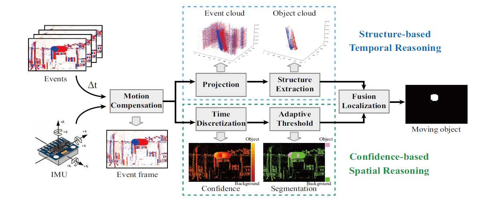

# JSTR: Joint Spatio-Temporal Reasoning for Event-based Moving Object Detection
# ICRA 2024
Hanyu Zhou, Zhiwei Shi, Hao Dong, Shihan Peng, Yi Chang, and Luxin Yan

 

# Data Preparation
The test data is placed in test_data, and the event data and IMU data are saved in txt format respectively.

# Run The Code
```python
python motion_seg_davis346-outflow_txt_ransac.py
```


